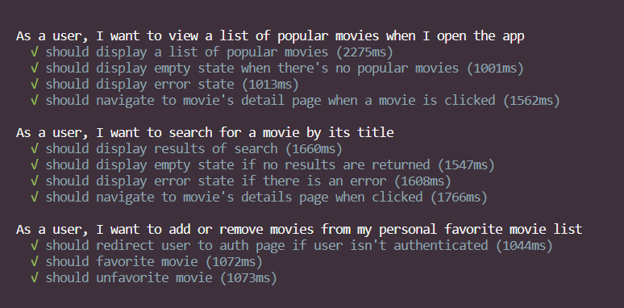

This is a [Next.js](https://nextjs.org/) project bootstrapped with [`create-next-app`](https://github.com/vercel/next.js/tree/canary/packages/create-next-app).

It also uses [shadcn/ui](https://ui.shadcn.com/) for the UI components.

## Running Cypress tests

Headed

- `npx cypress open` and run the app with `npm run dev` on a separate terminal. Or use the shortcut that does both `npm run cy`

Headless

- `npx cypress run` and run the app with `npm run dev` on a separate terminal

Test results

